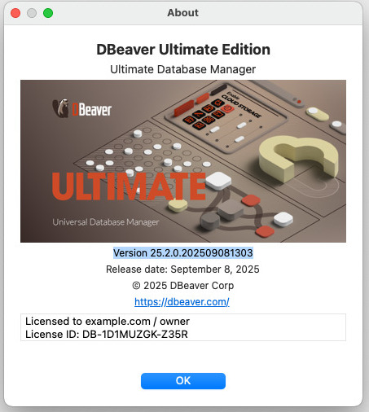
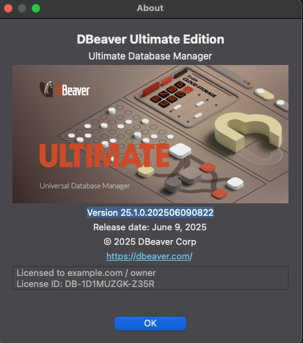

[English](README-EN.md)

# DBeaver Agent for 25.x




该分支针对 `25.1` 和 `25.2` 版本。

若需要参考 `25.0` 版本，请查看 [v25.0](https://github.com/wgzhao/dbeaver-agent/tree/v25.0) 分支,
若需参考 `24.x`版本，请查看 [v24.0](https://github.com/wgzhao/dbeaver-agent/tree/v24.0) 分支，
其他低版本则请参考 `master` 分支。

## 支持的版本

- `25.2`
- `25.1`

## 快速开始 🚀

### 方式一：一键自动部署（推荐）

使用 Python 自动部署脚本 `onekey.py`，一条命令完成所有配置：

```bash
# 提供 DBeaver 安装路径作为参数
python onekey.py "C:\Program Files\DBeaver"           # Windows
python onekey.py "/Applications/DBeaver.app"          # macOS
python onekey.py "/usr/share/dbeaver"                 # Linux

# Linux：如果 DBeaver 安装在系统目录（如 /usr/share/dbeaver），需要使用 sudo
sudo python3 onekey.py "/usr/share/dbeaver"

# 或者不带参数，交互式输入路径
python onekey.py
```

**脚本会自动完成以下操作：**
1. ✅ 从 DBeaver 安装目录提取版本信息和产品 ID
2. ✅ 查找并复制依赖 jar 文件到 `libs` 目录
3. ✅ 自动更新 `pom.xml` 中的版本号和依赖路径
4. ✅ 编译项目（使用 Maven）
5. ✅ 部署 agent jar 到 DBeaver plugins 目录
6. ✅ 自动生成许可证密钥并复制到剪贴板
7. ✅ 更新 `dbeaver.ini` 配置文件（添加 javaagent 参数）
8. ✅ 处理 JRE 依赖（重命名 jre 目录，强制使用系统 JDK）
9. ✅ macOS：自动删除 `-vm` 参数，使用系统 JDK
10. ✅ 启动 DBeaver

**前置要求：**
- Python 3.6+
- Maven（需要在 PATH 中可用）
- 系统 JDK 21（**强烈推荐使用 JDK 21**）

**Linux 特别说明：**
- 如果 DBeaver 安装在需要 root 权限的目录（如 `/usr/share/dbeaver`），请使用 `sudo` 运行脚本
- 脚本会自动以当前用户身份启动 DBeaver（通过 `sudo -u` 降权）
- **许可证密钥不会自动复制到剪贴板**，请在完成后手动复制终端显示的许可证

---

### 方式二：手动部署

如果您希望手动控制每个步骤，可以按照以下说明操作。

#### 1. 准备依赖文件

从 DBeaver 安装目录的 `plugins` 文件夹中，复制以下 jar 文件到本项目的 `libs` 目录：

- `com.dbeaver.lm.api_*.jar` - 许可证管理 API
- `org.jkiss.utils_*.jar` - 工具类库

#### 2. 更新 pom.xml

根据复制的 jar 文件版本，更新 `pom.xml` 中的依赖版本号和文件名。

#### 3. 构建项目

使用 Maven 构建项目，生成包含所有依赖的 jar 文件：

```bash
mvn clean package
```

生成的文件路径为 `target/dbeaver-agent-{version}-jar-with-dependencies.jar`。

#### 4. 安装 DBeaver Agent

将生成的 jar 文件复制到 DBeaver 安装目录的 `plugins` 文件夹，重命名为 `dbeaver-agent.jar`：

**Windows:**
```cmd
copy target\dbeaver-agent-*-jar-with-dependencies.jar "C:\Program Files\DBeaver\plugins\dbeaver-agent.jar"
```

**macOS:**
```bash
cp target/dbeaver-agent-*-jar-with-dependencies.jar "/Applications/DBeaver.app/Contents/Eclipse/plugins/dbeaver-agent.jar"
```

**Linux:**
```bash
cp target/dbeaver-agent-*-jar-with-dependencies.jar /usr/share/dbeaver/plugins/dbeaver-agent.jar
```

#### 5. 配置 dbeaver.ini

修改 DBeaver 安装目录下的 `dbeaver.ini` 文件（macOS 位于 `Contents/Eclipse/dbeaver.ini`），在 `-vmargs` 下方添加：

```ini
-vmargs
-javaagent:plugins/dbeaver-agent.jar
-Dlm.debug.mode=true
```

**macOS 特别注意：**
- javaagent 路径应为：`-javaagent:../Eclipse/plugins/dbeaver-agent.jar`
- 如果存在 `-vm` 参数，请删除该参数及其下一行的 JRE 路径

**Windows 命令行用户：**
- 若需使用 `dbeaver-cli.exe` 查看详细日志，将 `dbeaver.ini` 复制一份为 `dbeaver-cli.ini`

#### 6. 处理 JRE 依赖

**强烈推荐使用系统 JDK 21** 而非 DBeaver 内置的 JRE：

- **安装 JDK 21**：安装后验证 `java -version`（应显示 Java 21）

- **重命名 jre 目录**：将 DBeaver 安装目录下的 `jre` 文件夹重命名为 `jr`（或其他名称），这样 DBeaver 会自动使用系统 JDK。
- **macOS**：删除 `dbeaver.ini` 中的 `-vm` 参数（如果存在）。

#### 7. 激活许可证并关闭数据分享

初次启动 DBeaver 后：

1. 点击 **Import license**
2. 粘贴生成的许可证密钥
3. 点击 **Import** 按钮激活
4. **重要**：激活后勾选 **"Do not share data"**

另外，为了避免 DBeaver 向 `stats.dbeaver.com` 发送数据，可以修改 hosts 文件：

```
127.0.0.1 stats.dbeaver.com
```

---

## 生成许可证密钥

### 命令行界面 (CLI)

```bash
# Linux/macOS
./gen-license.sh

# Windows
gen-license.bat
```

**支持的参数：**

```
Usage: gen-license [-h] [-p=<productName>] [-t=<licenseType>] [-v=<productVersion>]

选项：
  -h, --help                显示帮助信息
  -p, --product=<name>      产品名称：dbeaver（默认）
  -t, --type=<type>         许可类型：le（Lite版）、ee（Enterprise版）、ue（Ultimate版，默认）
  -v, --version=<version>   产品版本：默认 25
```

**示例：**

```bash
# 生成 DBeaver Ultimate Edition 25 许可证（默认）
./gen-license.sh

# 生成 DBeaver Enterprise Edition 24 许可证
./gen-license.sh -t ee -v 24
```

> **注意**：关于 CloudBeaver 支持，请查看 #10

### 图形用户界面 (GUI)

为了更方便的使用，提供了跨平台的图形用户界面。

#### 启动 GUI

**Windows:**
```cmd
start-ui.bat
```

**Linux/macOS:**
```bash
./start-ui.sh
```

#### GUI 特性

- 🎨 **平台原生外观**：在不同操作系统上显示相应的原生界面风格
- 📝 **简单易用**：下拉菜单选择产品和许可类型，文本框输入版本号
- ⚡ **即时反馈**：状态栏显示操作进度和结果
- 📋 **一键复制**：生成许可证后可直接复制到剪贴板
- 🛡️ **错误处理**：输入验证和友好的错误提示

更多关于 GUI 的详细信息，请参阅 [UI-DOCUMENTATION.md](UI-DOCUMENTATION.md)。

---

## 常见问题

### Q: 需要使用什么版本的 JDK？

A: **强烈推荐使用 JDK 21**。原因：
- DBeaver 25.x 版本与 JDK 21 兼容性最佳
- Agent 需要较新的 Java 特性支持
- 安装后验证：`java -version`

### Q: 启动 DBeaver 后许可证不生效？

A: 建议从命令行启动 DBeaver 以查看详细日志：

```bash
# Windows
"C:\Program Files\DBeaver\dbeaver.exe"
# 或使用 CLI 版本查看详细日志
"C:\Program Files\DBeaver\dbeaver-cli.exe"

# macOS
open /Applications/DBeaver.app

# Linux
/usr/share/dbeaver/dbeaver
```

**Windows 提示**: onekey.py 脚本会自动创建 `dbeaver-cli.ini`，方便使用 `dbeaver-cli.exe` 查看详细日志。

检查控制台输出中是否有 agent 加载成功的信息。另外确保已激活许可证并勾选了 "Do not share data"。

### Q: Maven 编译失败？

A: 确保：
1. Maven 已正确安装并在 PATH 中可用（运行 `mvn -version` 检查）
2. **JDK 21 已安装**（运行 `java -version` 检查）
3. 依赖的 jar 文件已正确复制到 `libs` 目录
4. `pom.xml` 中的版本号和文件名与实际文件匹配

### Q: macOS 上 DBeaver 启动失败？

A: 检查：
1. 是否正确删除了 `dbeaver.ini` 中的 `-vm` 参数
2. **系统是否安装了 JDK 21**（运行 `java -version` 检查）
3. `dbeaver.ini` 中的 javaagent 路径是否正确（应为 `../Eclipse/plugins/dbeaver-agent.jar`）

### Q: 自动部署脚本失败？

A: `onekey.py` 脚本会提供详细的错误信息和进度提示。常见问题：
- 确保提供的 DBeaver 路径正确
- 确保 Maven 已安装
- **确保系统已安装 JDK 21**
- Linux：如果 DBeaver 安装在系统目录，确保使用 `sudo` 运行脚本
- 查看脚本输出的详细错误信息

### Q: Linux 下为什么许可证没有自动复制到剪贴板？

A: 由于 Linux 下使用 `sudo` 运行脚本时，剪贴板工具（wl-copy、xclip 等）存在环境变量配置问题，脚本不会自动复制许可证。完成部署后，许可证密钥会显示在终端中，请手动复制：

```
--- LICENSE ---
[许可证密钥显示在这里]
--- END LICENSE ---
```

然后粘贴到 DBeaver 的 "Import license" 对话框中即可。

---

## 支持的产品
## 支持的产品

- ✅ **DBeaver Ultimate Edition** (UE)
- ✅ **DBeaver Enterprise Edition** (EE)
- ✅ **DBeaver Lite Edition** (LE)

> **注意**：关于 CloudBeaver 支持，请查看 [#10](https://github.com/sino1641/dbeaver-agent/issues/10)

## 支持的操作系统

- ✅ **Windows** 10/11
- ✅ **macOS** 10.15+ (推荐 macOS 12.6+)
- ✅ **Linux** (各主流发行版)

---

## Star History

[](https://www.star-history.com/#wgzhao/dbeaver-agent&Date)
